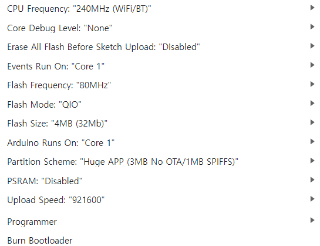

## 📡 ESP32 Web-Linked Database System

A project integrating **ESP32 hardware**, a **Flask web server**, and **MySQL database** for actuator control via **BLE, Wi-Fi (HTTP)**, and **UART**.

---

### 🛠️ System Overview

| Component      | Description                            |
|----------------|----------------------------------------|
| **Database**   | MySQL (via Docker Compose)             |
| **Web Server** | Flask-based RESTful API                |
| **Hardware**   | ESP32 (UART TX: GPIO 16, RX: GPIO 17)  |
| **Protocols**  | BLE, Wi-Fi (HTTP), UART                |

---

### 🚀 How to Run

1. **Start MySQL database using Docker:**

   ```bash
   docker compose up -d
   ```

2. **Edit database connection info in db.py:**

   ```python
   # MySQL connection info
    DB_HOST = "127.0.0.1"
    DB_PORT = 3306
    DB_USER = "root"
    DB_PASSWORD = "your_password"
    DB_NAME = "embb"
   ```

3. **Run the Flask web server:**

   ```bash
   python web_project.py
   ```

4. **Upload the ESP32 driver code:**

   - Open `esp32_driver.ino` in Arduino IDE  
   - Select the correct board and port  
   - Edit Wi-Fi and server address in esp32_driver.ino
    ```cpp
       // WiFi
        const char* ssid = "your_wifi_ssid";
        const char* password = "your_wifi_password";

        // Web-server URL
        const char* getUrl = "http://<your_server_ip>:8000/get";
        const char* updateUrl = "http://<your_server_ip>:8000/update";
    ```
   - Upload to your ESP32
   - ESP32 Arduino IDE Settings

    **ESP32 Arduino IDE Settings**  
    Ensure the following settings in **Arduino IDE** before uploading:  
    

---

### 📡 Communication Flow

```
[Main ECU] ⇄ UART ⇄ [ESP32] ⇄ Wi-Fi HTTP ⇄ [Flask Web Server] ⇄ [MySQL Server]
                        ⇅ 
                       BLE
                        ⇅     
                     [Mobile]
```

---

### 📦 UART Packet Format

| Field            | Size (bytes) | Description                        |
|------------------|---------------|------------------------------------|
| `start_byte`     | 1             | Packet start marker (e.g. 0xAA)    |
| `packet_id`      | 1             | Packet identifier (e.g. 0x01)      |
| `led_rgb`        | 1             | 3-bit RGB value (bit flags), padded to 1 byte |
| `fan`            | 2 bits        | Fan speed (0–3)                    |
| `led`            | 1 bit         | Headlight on/off                   |
| `buzzer`         | 1 bit         | Buzzer on/off                      |
| `driving_mode`   | 4 bits        | Driving mode (0–15)                |
| `servo_chair`    | 2 bytes       | Chair angle (0–4095)               |
| `servo_window`   | 2 bytes       | Window position (0–4095)           |
| `front_distance`      | 2 bytes       | Front object distance (0–4095)               |
| `crc`            | 1 byte        | Checksum (optional, currently 0)   |

> 🔧 Total size: **11 bytes (packed)**


---

### 🧪 API Specification

#### 🔹 `GET /get?mac=XX:XX:XX:XX:XX:XX`

- **Description**: Returns the latest actuator state for the given MAC address.  
  If not found, inserts a default record.
- **Response Example**:

```json
{
  "message": "user exists",
  "mac_address": "76:be:74:30:f7:ca",
  "led_rgb": 0,
  "fan": 1,
  "led": 0,
  "buzzer": 0,
  "driving_mode": 0,
  "servo_chair": 1000,
  "servo_window": 2000,
  "front_distance": 1500,
  "updated_at": "Mon, 05 May 2025 22:07:01 GMT"
}
```

---

#### 🔹 `POST /update`

- **Description**: Updates the latest actuator record for the given MAC.
- **Request Body (JSON)**:

```json
{
  "mac_address": "76:be:74:30:f7:ca",
  "led_rgb": 3,
  "fan": 2,
  "led": 1,
  "buzzer": 1,
  "driving_mode": 4,
  "servo_chair": 1200,
  "servo_window": 1800,
  "front_distance": 1600
}
```

- **Response Example**:

```json
{
  "buzzer": 0,
  "driving_mode": 0,
  "fan": 1,
  "led": 0,
  "led_rgb": 0,
  "mac": "5c:ab:72:7c:c9:3b",
  "mac_address": "5c:ab:72:7c:c9:3b",
  "message": "default inserted",
  "front_distance": 1500,
  "servo_chair": 1000,
  "servo_window": 2000
}
```

---