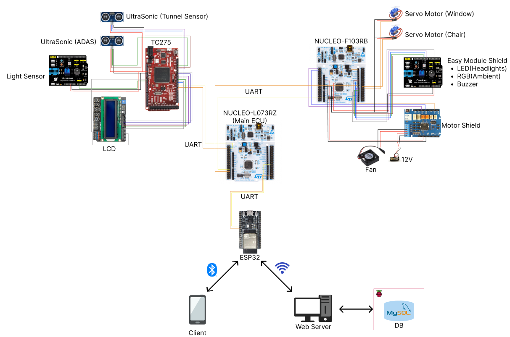

# 개인 차량 동기화 서비스

## 팀원

| 김민 | 김준혁 | 류병민 | 이윤기 | 오동걸 | 호세헌 |
|:----:|:------:|:------:|:------:|:------:|:------:|
|  |  |  |  |  |  |
| Lead<br/>TC275 | STM32 Actuator | STM32 Main | STM32 Actuator | TC275 | Arduino <br/> Server |
| [min-kim-oss](https://github.com/min-kim-oss) | [knujhk](https://github.com/knujhk) | [bmryu0501](https://github.com/bmryu0501) | [yg654](https://github.com/yg654) | [fepick](https://github.com/fepick) | [seheonnn](https://github.com/seheonnn) |

## 아키텍처


## Description

- [`STM32_main`](./STM32_main/README.md): 메인 MCU 로직 (터널 진입 여부 판단 및 데이터 송신)
- [`STM32_act`](./STM32_act/README.md): 액추에이터 제어 로직 (서보 모터, LED, RGB, 팬)
- [`TC275`](./TC275/README.md): 인포테인먼트 제어 (LCD), 초음파 센서, 조도 센서 처리
- [`Arduino`](./Arduino/README.md): BLE 통신 처리 (ESP32), Web 서버(Flask) 및 데이터베이스 연동

## 브랜치 구조

```
main
└── develop
    ├── STM32_main
    │   ├── feat/#이슈번호
    │   └── fix/#이슈번호
    ├── STM32_act
    │   ├── feat/#이슈번호
    │   └── fix/#이슈번호
    ├── Arduino
    │   ├── feat/#이슈번호
    │   └── fix/#이슈번호
    └── TC275
        ├── feat/#이슈번호
        └── fix/#이슈번호
```

## 커밋 컨벤션

| 태그이름   | 내용                                                                  |
| ---------- | --------------------------------------------------------------------- |
| `feat`     | 새로운 기능을 추가할 경우                                             |
| `fix `     | 버그를 고친 경우                                                      |
| `!hotfix`  | 급하게 치명적인 버그를 고쳐야하는 경우                                |
| `refactor` | 코드 리팩토링 (코드 스타일 변경, 파일명 수정... 프로덕션 코드 변경 X) |
| `docs`     | 문서를 수정한 경우                                                    |
| `test`     | 테스트 추가, 테스트 리팩토링(프로덕션 코드 변경 X)                    |
| `cicd`     | 배포 방식 수정 및 새로 추가 / 기존 배포 스크립트 수정                 |
