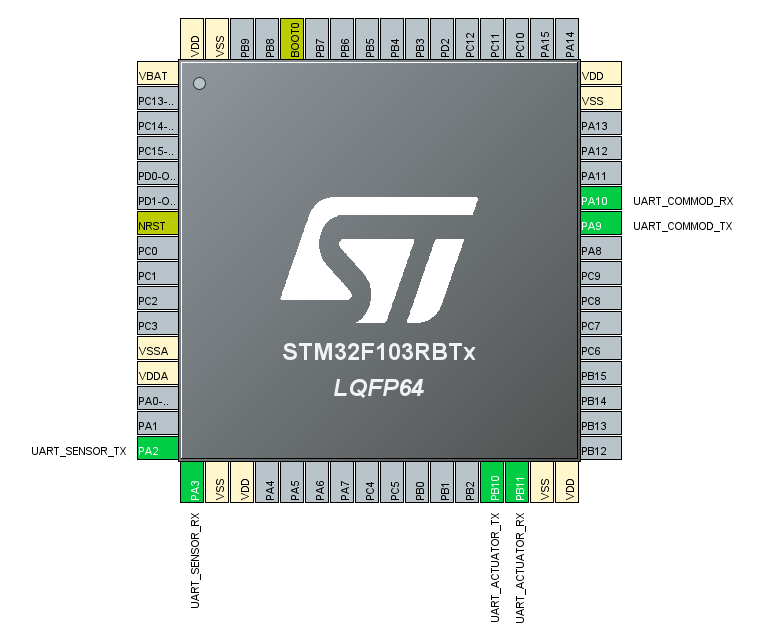

# STM32_main

## 개요
보드 정보 : STM32F103RBT6 (NUCLEO-F103RB)

## 포팅 매뉴얼
### 보드 세팅 (CubeMX 활용)

MCU/MPU Selector에서 STM32F103RBT6(NUCLEO-F103RB) 선택

Start Project로 Project 시작

왼쪽 탭의 Connectivity에서 UART 활성화 (Asynchronous mode)

설정값
**Baud Rate** 115200 Bits/s
**Word Length** 8 Bits
**Parity** None
**Stop Bits** 1

NVIC Settings 메뉴에서 Interrupt를 활성화 해준다.

DMA Settings 메뉴에서 DMA를 추가해준다.

같은 방법으로 USART1, USART2, USART3를 모두 설정해준다.
편의상 UART의 Label을 바꿔주었다.

- UART1 RX/TX: UART_COMMOD_RX/TX
- UART2 RX/TX: UART_SENSOR_RX/TX
- UART3 RX/TX: UART_ACTUATOR_RX/TX

NUCLEO-F103RB 보드의 pinmap에 맞추어 각 pin에 잘 꽂아주면 된다.

Project Manager 탭에서 Project 이름을 설정하고 Toolchain/IDE를 STM32CubeIDE로 설정한다.

GENERATE CODE를 눌러 프로젝트를 생성한다.

### 코드 포팅

@Todo: 필요 코드 파일

## 함수

- void UART_SendString(const char* str);
string 형태로 UART 송신
- void UART_SendFormatted(const char* format, ...);
printf 형태로 format 지정하여 UART 송신

@Todo: 함수 추가 후 설명 추가

## 통신 프로토콜 (UART)
### Actuator Packet (액추에이터 제어 패킷)
| Field             | Size (Bytes) | Bit Detail             | Description                           |
| ----------------- | ------------ | ---------------------- | ------------------------------------- |
| `start_byte`      | 1            | 8 bits                 | Start of packet (`0xAA`)              |
| `packet_id`       | 1            | 8 bits                 | Packet ID (`0x01` for actuator)       |
| `led_rgb` (union) | 1            | R:1, G:1, B:1 (3 bits) | RGB LED flags (bitfield)              |
| `fan`             | -            | 2 bits                 | Fan speed (0–3)                       |
| `led`             | -            | 1 bit                  | Headlight on/off                      |
| `buzzer`          | -            | 1 bit                  | Buzzer on/off                         |
| `darkmode`        | -            | 1 bit                  | Dark mode on/off                      |
| *padding*         | -            | 3 bits                 | (to fill one full byte)               |
| `driving_mode`    | 1            | 4 bits                 | Driving mode (0–15)                   |
| *padding*         | -            | 4 bits                 | (Reserved for more driving mode)      |
| `servo_chair`     | 2            | 12 bits used           | Chair tilt (scaled from 0–4095)       |
| `servo_window`    | 2            | 12 bits used           | Window position (scaled from 0–4095)  |
| `front_distance`  | 2            | 12 bits used           | Window position (scaled from 0–4095)  |
| `crc`             | 1            | 8 bits                 | Checksum or CRC                       |
| **Total**         | **10 bytes** |                        |                                       |

### Seonsor Packet (센서 데이터 전송 패킷)
| Field         | Size (Bytes) | Bit Detail   | Description                           |
| ------------- | ------------ | ------------ | ------------------------------------- |
| `start_byte`  | 1            | 8 bits       | Start of packet (`0xAA`)              |
| `packet_id`   | 1            | 8 bits       | Packet ID (`0x02` for sensor)         |
| `photo`       | 2            | 16 bits r    | Ambient brightness (0–4095)           |
| `ultra_sonic1`| 2            | 16 bits      | Ultrasonic distance (2–400cm typical) |
| `ultra_sonic2`| 2            | 16 bits      | Ultrasonic distance (2–400cm typical) |
| `crc`         | 1            | 8 bits       | Checksum or CRC                       |
| **Total**     | **9 bytes**  |              |                                       |
